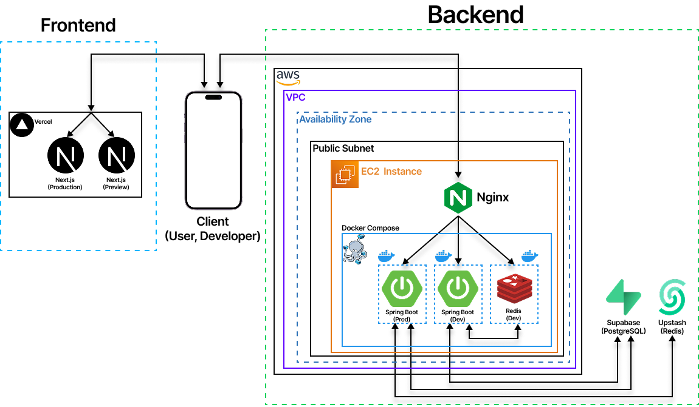
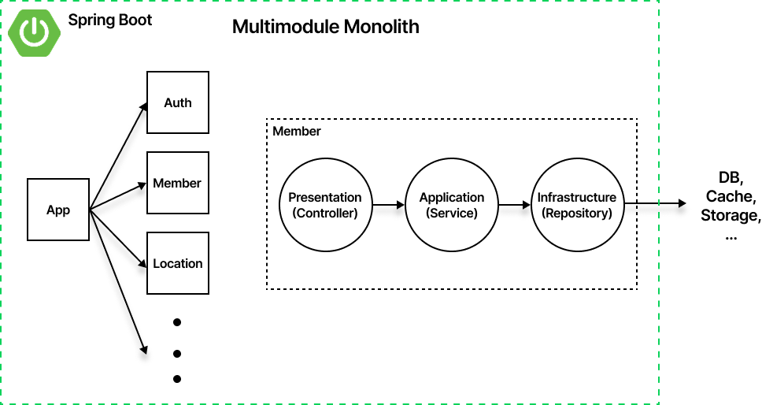

# 날씨로그

동네 사람들이 남긴 제보로 지금 우리 동네 날씨를 확인하는 서비스입니다. 예보가 답해주지 않는 "지금 밖이 어떤지"를, 그 동네에 있는 사람의 기록으로 봅니다.

[](https://nalssilog.com)

## 기능

- **제보** — 기온·강수·햇빛 세 가지 상태와 한 줄 코멘트, 사진 3장까지. 로그인 없이도 남길 수 있습니다.
- **동네 현황** — 지역별 제보 통계와 최신 피드. 커서 페이징으로 이어서 봅니다.
- **전국 속보** — 최근 24시간 동안 전국에 올라온 제보를 최신순으로.
- **인기 지역** — 최근 30일 제보량 기준 순위와 직전 대비 등락.
- **동네 찾기** — 법정동 검색과 GPS 좌표 역지오코딩, 자주 보는 동네 즐겨찾기.
- **고마워요** — 도움이 된 제보에 남기는 표시.
- **신고·차단** — 부적절한 제보 신고와 작성자 차단. 운영자 검토와 제재로 이어집니다.
- **로그인** — Google·Kakao·Naver·Apple 소셜 로그인과 기기별 세션 관리.

## 왜 만들었나

예보는 격자 단위로 나오지만 사람은 동네 단위로 옷을 고릅니다. 같은 시각 같은 구에서도 어떤 골목은 비가 오고 어떤 골목은 안 옵니다.

그래서 예보를 더 정확하게 만드는 대신 그 자리에 있는 사람에게 물어보기로 했습니다. 이때 걸리는 문제는 정확도가 아니라 **참여 장벽**과 **신뢰**입니다. 로그인해야 제보할 수 있으면 기록이 모이지 않고, 아무나 제보할 수 있으면 그 기록을 믿을 수 없습니다.

**로그인 없이도 제보할 수 있게 하면서, 익명 작성자도 회원과 똑같이 신고·차단·제재할 수 있게** 만드는 것이 이 서버가 푸는 문제입니다.

---

## 기술 스택

| 구분 | 사용 |
|---|---|
| Language | Java 25 |
| Framework | Spring Boot 4.1, Spring Security, Spring Data JPA |
| Database | PostgreSQL (Supabase), Flyway |
| Cache / Session | Redis (Upstash) |
| Query | QueryDSL |
| Auth | OAuth2 (Google / Kakao / Naver / Apple), JWT |
| Storage | Cloudflare R2 (로컬은 MinIO) |
| Testing | JUnit 5, Testcontainers |
| Infra | Docker Compose, GitHub Actions, GHCR, AWS EC2 |

---

## 아키텍처

### 외부



웹은 Vercel, API 서버는 AWS EC2 한 대에서 돌아갑니다. 상태를 가진 저장소는 EC2 밖의 관리형 서비스에 두었습니다.

이미지는 API 서버를 거치지 않고 클라이언트가 오브젝트 스토리지로 직접 올립니다. 서버는 업로드 URL 만 발급합니다.

### 내부



하나의 Spring Boot 애플리케이션이지만 도메인별로 Gradle 모듈을 분리했습니다.

| 모듈 | 역할 | 저장소 |
|---|---|---|
| `app` | 실행 진입점, 스키마 마이그레이션, 전역 예외 | — |
| `auth` | 소셜 로그인, 토큰 회전, 기기 세션, 게스트 자격증명 | Redis, PostgreSQL |
| `member` | 회원, 소셜 연동, 프로필·아바타, 약관 동의 | PostgreSQL |
| `location` | 법정동 검색, 좌표 역지오코딩, 인기 지역 | PostgreSQL |
| `report` | 제보, 고마워요, 신고·차단, 모더레이션 | PostgreSQL, Redis |
| `storage` | presigned URL 발급 | Cloudflare R2 |
| `common` | 공통 응답·예외·커서 페이징 | — |

모듈 안은 표현·응용·영속 세 계층으로 나뉘고, 의존은 안쪽으로만 흐릅니다.

```
api          Controller    요청 해석과 응답 변환. 도메인 규칙을 두지 않는다
application  Service       유스케이스. 트랜잭션 경계
repository   Repository    영속화와 조회 쿼리
domain       Entity/Enum   불변 조건. 다른 계층을 모른다
```

모듈은 다른 모듈의 엔티티를 직접 참조하지 않습니다.

지금은 같은 프로세스 안의 메서드 호출이지만, 창구 구현만 HTTP 클라이언트로 바꾸면 모듈을 그대로 떼어낼 수 있습니다. 역방향 의존이 생기지 않도록 Gradle 의존 선언 자체를 단방향으로 잠갔습니다.
